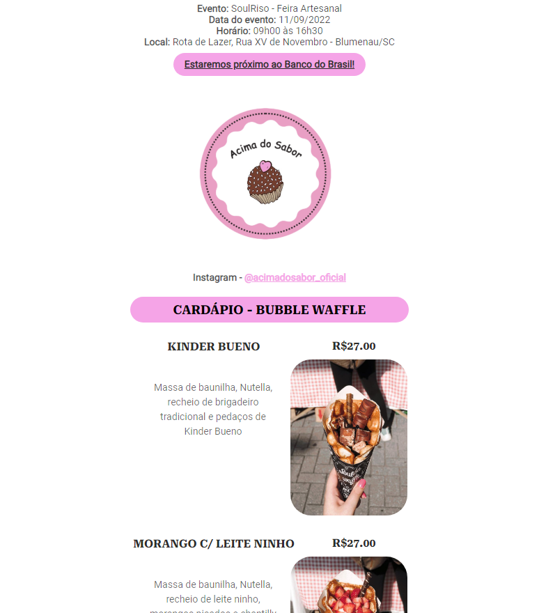

# cardapioAcimaDoSabor

Simple online menu made for a confectionery company for a specific day of a fair

Such a menu was released via netlify [Click here for access](https://cardapio-acimadosabor.netlify.app/)

The menu contains information about the fair, such as name, location, date and time, as well as the company's instagram.

There is also a list of available products, with their name, description, image and price.

A QR Code was also created for people to be able to access the menu while they are waiting in the service queue.

